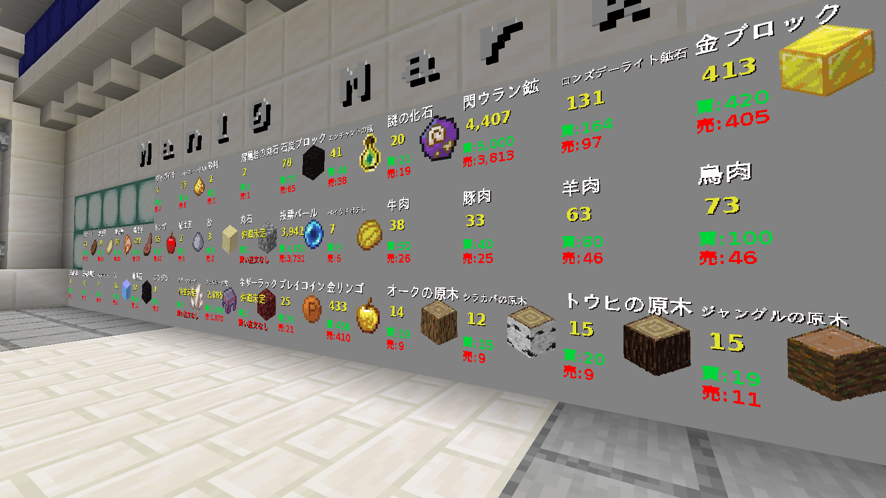
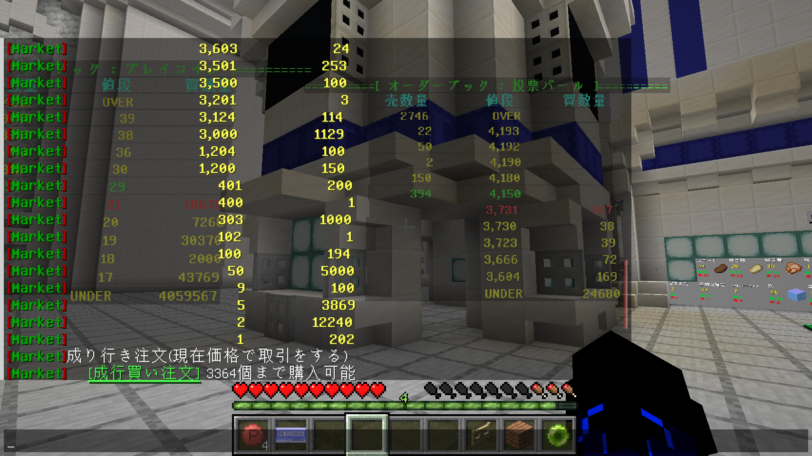
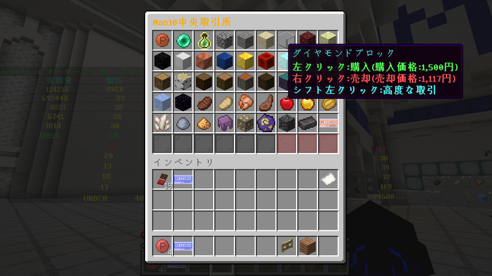

# Man10Market

Man10サーバー用の総合的な取引所プラグインです。プレイヤーがアイテムを売買できる市場システムを提供します。

## 機能

### 取引所システム
- プレイヤー間のアイテム売買
- 成行注文と指値注文
- リアルタイム価格表示
- 注文履歴の記録と表示



**注意**: スクリーンショットに表示されるアイテムやテクスチャはリソースパックのものを使用しています。

### 板注文画面
- アイテムごとの買い注文と売り注文の一覧表示
- リアルタイムの価格更新
- 注文深度の視覚化



**注意**: スクリーンショットに表示されるアイテムやテクスチャはリソースパックのものを使用しています。

### 取引メニュー
- インベントリGUIを使用した簡単な操作
- 買い注文と売り注文の管理
- 注文履歴の確認



**注意**: スクリーンショットに表示されるアイテムやテクスチャはリソースパックのものを使用しています。

## コマンド

### 基本コマンド
- `/mce` - メインメニューを開く
- `/mce price <銘柄名>` - 指定アイテムの価格情報を表示
- `/mce allprice` - 全アイテムの価格情報を表示

### 取引コマンド
- `/mce marketbuy <銘柄名> <個数>` - 成行買い注文
- `/mce marketsell <銘柄名> <個数>` - 成行売り注文
- `/mce orderbuy <銘柄名> <個数> <価格>` - 指値買い注文
- `/mce ordersell <銘柄名> <個数> <価格>` - 指値売り注文
- `/mce ordercancel <注文ID>` - 指値注文をキャンセル
- `/mce showorder` - 自分の注文一覧を表示

### 管理者コマンド
- `/mce op reload` - 市場システムをリロード
- `/mce op on` - 市場を開場
- `/mce op off` - 市場を閉場
- `/mce op showorder <UUID>` - 指定プレイヤーの注文一覧を表示
- `/mce op map <銘柄名>` - 価格チャートマップを取得

### 株式コマンド
- `/mstock` - 株式関連コマンド

## 権限
- `market.op` - 管理者権限
- `market.user` - 一般ユーザー権限

## インストール方法

1. プラグインJARファイルをサーバーの`plugins`フォルダに配置します
2. サーバーを再起動するか、`/reload`コマンドを実行します
3. `config.yml`を必要に応じて編集します
4. MySQLデータベースを設定します

## 設定

`config.yml`で以下の設定が可能です：

```yaml
mysql:
  host: localhost
  user: root
  pass: pass
  port: 3306
  db: man10_market

MarketOpen: true  # 市場が開いているかどうか
CSVPath: ""       # 価格データCSVの保存先
```

## 依存プラグイン

- Man10CommonLibs（必須）
- Man10Bank（必須）
- Man10ItemBank（必須）

## 開発者

- [Man10 Project](https://man10.red)

## 画像について

本READMEに使用されている画像内のアイテムやテクスチャは、Man10サーバー専用のリソースパックを使用しています。標準のMinecraftテクスチャとは異なる場合があります。

## 注意事項

- このプラグインはMySQLデータベースを使用します。適切に設定してください。
- サーバーの経済システムに大きな影響を与える可能性があるため、テスト環境での十分な検証をお勧めします。
- バグや問題を発見した場合は、GitHubのIssueで報告してください。
- Man10BankとMan10ItemBankプラグインが必要です。これらのプラグインがなければ動作しません。
